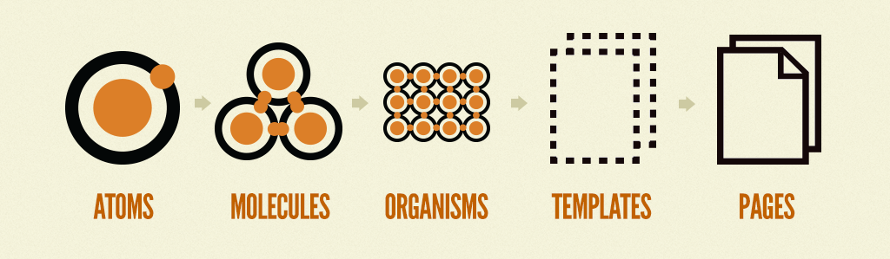

# Exercise 1 – Overview

This first excercise is more of a reading excercise than a practical excercise. The goal is to familiarize yourself with structure of the Pattern Lab installation, the build step, and the underlying methodology that spawned the creation of the framework, namely _atomic design_.

## Atomic Design

> This section goes into the thinking behind the design methodology _atomic design_. if you are more eager to start on one of the practical excercises, feel free to skip to [the next section](#pattern-lab-folder-structure) or jump straight to **exercise 2**. We would however urge you to come back and read this section at a later time, as it it will make it more clear why our installation of Pattern Lab is organized the way it is.

Atomic design is methodology for creating design systems. There are five distinct levels in atomic design:

1. Atoms
2. Molecules
3. Organisms
4. Templates
5. Pages

### Atoms
Atoms are the basic building blocks of matter. Applied to web interfaces, atoms are our HTML tags, such as a form label, an input or a button.

Atoms can also include more abstract elements like color palettes, fonts and even more invisible aspects of an interface like animations.

Like atoms in nature they’re fairly abstract and often not terribly useful on their own. However, they’re good as a reference in the context of a pattern library as you can see all your global styles laid out at a glance.

### Molecules

Things start getting more interesting and tangible when we start combining atoms together. Molecules are groups of atoms bonded together and are the smallest fundamental units of a compound. These molecules take on their own properties and serve as the backbone of our design systems.

For example, a form label, input or button aren’t too useful by themselves, but combine them together as a form and now they can actually do something together.

Building up to molecules from atoms encourages a “do one thing and do it well” mentality. While molecules can be complex, as a rule of thumb they are relatively simple combinations of atoms built for reuse.

### Organisms
Molecules give us some building blocks to work with, and we can now combine them together to form organisms. Organisms are groups of molecules joined together to form a relatively complex, distinct section of an interface.

We’re starting to get increasingly concrete. A client might not be terribly interested in the molecules of a design system, but with organisms we can see the final interface beginning to take shape.

Organisms can consist of similar and/or different molecule types. For example, a masthead organism might consist of diverse components like a logo, primary navigation, search form, and list of social media channels. But a “product grid” organism might consist of the same molecule (possibly containing a product image, product title and price) repeated over and over again.

Building up from molecules to organisms encourages creating standalone, portable, reusable components.

### Templates
At the template stage, we break our chemistry analogy to get into language that makes more sense to our clients and our final output. Templates consist mostly of groups of organisms stitched together to form pages. It’s here where we start to see the design coming together and start seeing things like layout in action.

Templates are very concrete and provide context to all these relatively abstract molecules and organisms. Templates are also where clients start seeing the final design in place.

### Pages
Pages are specific instances of templates. Here, placeholder content is replaced with real representative content to give an accurate depiction of what a user will ultimately see.

Pages are the highest level of fidelity and because they’re the most tangible, it’s typically where most people in the process spend most of their time and what most reviews revolve around.

The page stage is essential as it’s where we test the effectiveness of the design system. Viewing everything in context allows us to loop back to modify our molecules, organisms, and templates to better address the real context of the design.

Pages are also the place to test variations in templates. For example, you might want to articulate what a headline containing 40 characters looks like, but also demonstrate what 340 characters looks like. What does it look like when a user has one item in their shopping cart versus 10 items with a discount code applied? Again, these specific instances influence how we loop back through and construct our system.

The creator of Atomic Design, Brad Frost, has also published a book online where he goes into greater detail about the concepts surrounding Atomic Design and the use of Pattern Lab. You can read the book [here](http://atomicdesign.bradfrost.com/table-of-contents/).

## Pattern Lab folder structure

Firts let's open up the `styleguide` directory in our repo in our preferred text editor (given that it has a directory browser that is). If using Atom you should be able to do this simply by typing `atom .` from the command line (while inside the `styleguide` directory)

Inspecting the structure we should see a couple of files and folders. The following lists the ones that are interesting to us in this workshop:

* The `package.json` file is what specified which dependecies we installed earlier when we ran `npm install`
* The `node_modules` folder is where all our dependecies are installed
* The `gulpfile.js` specifies all our Pattern Lab build tasks, which we'll discuss more in the following section.
* The `source` folder contains all our working files. Discussed more below.
* The `public` folder is where all our compiled files are copied when we invoke certain build tasks defined in `gulpfile.js`.
* The `patternlab-config.json` file contains settings for our Pattern Lab installation. This file holds paths used in our build, allowing to have complete controll over where we keep our `source` files and where the solution is built (`public`). It also allows us to controll which UI elements we want in our main Pattern Lab menu, set the system in debug mode, and a lot of other things.

### The `source` folder
If we open up our `source` folder we'll see the the folder structure used to hold our working files. The folders prefixed by an underscore `_` are Pattern Lab specific:

* `_annotations` contains files used to document specific selectors used in our CSS. Here we can specifiy selectors (for instance a .class or #id) and explain their purpose, or documet their use to other developers.
* `_data` contains files used to create dummy data (lipsum) when developing in Pattern Lab. This can be very convenient when sketching out certain UI-components.
* `_meta` contains the "header" and "footer" partials for our Pattern Lab site. For instance used if you want to reference a third party library hosted by a CDN. In our case we are linking to font files that we get from Google Fonts inside `_00-head.mustache`.
* `_patterns` contains all our pattern templates. As you can see it follows the structure defined by _atomic design_. We have `atoms`, `molecules`, `organisms`, `templates` and `pages`. The numbers you see prefixed in file and folder names are used strictly for ordering. Within each you will find one or several pattern templates, this are the files with the `.mustache` ending.

A single pattern can be defined by the combination of three files

1. A template file suffixed by `.mustache`. This file contains our actual Mustache markup
2. A data file suffixed by `.json`
3. A documentation file suffixed by `.md`

The data and documentation files are optional, but enbles some more advanced syntax, and a way to document your patterns.

The unprefixed folders in `source` keep our non-Pattern lab source files, for instance CSS, JavaScript, images, etc. Basically anything you need in addition to the templates to create your site.

## Pattern Lab build
If we open up `gulpfile.js` we'll see a list of dependecies (stored as js variables), functions, and Gulp tasks.

The gulpfile is responsible for defining all the task we run from the command line, like we did earlier with `gulp serve`. This actually trigger a series of tasks that goes through all the steps to build our Pattern Lab solution and serve it from a local web server. It activates another task which listens for changes to our files and auto-reloads our site in the browser if we make changes to our source files. If we wanted to just build our solution without the web server and auto reloading, we could simply type `gulp` as a command.

One thing that's nice about Pattern Lab being built with gulp is the fact that we can easily modify the gulpfile to do additional tasks. If you open up `gulpfile.js` you will see that we've added some custom functionality (look for the comments) that we want in our own build process.

There no limits to how many additional build steps you add to your gulpfile, but it might be an idea to limit yourself a little bit in order to keep the file manageble😀

Some of the more common tasks we add include are tasks that:
* Compiles sass, including vendor prefixing to support older browsers.
* Checks the code (scss, js, mustache) for syntax errors
* Provides better error logging
* Creates icon sprites
* Possibilities are endless

Now, enough with all the theory! Lets get to **exercise 2** where we actually start building something.

### [Go to exercise 2 :arrow_right:](../exercise2)