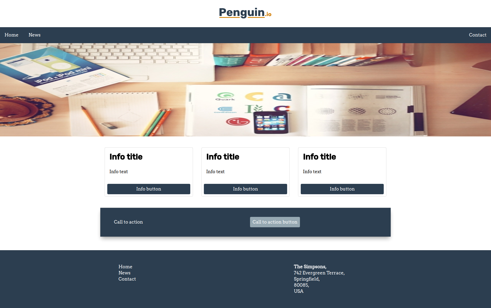

# Exercise 2

Look at the sketch of the home page. Split the page into suitable components and create a home page template.

You can split up the components as you like, both atoms, molecules and organisms. 

